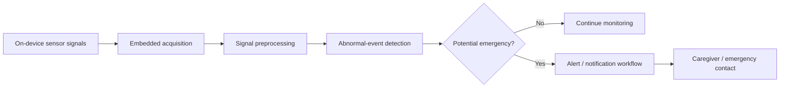

<div align="center">

# Walking Stick with Heart-Attack Detection
### Early Smart Assistive-Device Project Archive


</div>

## Overview

This repository was created for an early project concept exploring a **smart walking stick with health-event detection and alerting**. It belongs to my undergraduate exploration of embedded and intelligent devices.

The current public repository contains only this project page; the original source code, hardware schematics, sensor configuration and experimental records are not available here. For that reason, this README documents the intended project direction without inventing a specific sensing modality, medical model, accuracy, or hardware implementation.

## Conceptual System

At a high level, an assistive-device project of this type connects on-device sensing with event analysis and an emergency-response path:



**Important:** the diagram above represents the original project idea at a conceptual level. The repository does not currently contain enough implementation evidence to specify the sensors, algorithm, threshold logic, or communication protocol used at the time.

## Project Motivation

The project topic combines two undergraduate interests:

- **assistive hardware** for improving daily mobility and safety;
- **embedded intelligence** for detecting unusual physiological or behavioral signals and triggering a response.

It is preserved as an early project milestone rather than as a medical product or validated health-monitoring system.

## Repository Status

```text
Walking-Stick-with-Heart-Attack-Detection/
└── README.md
```

No executable implementation is currently public.

## Reproducibility / Safety Note

This repository **must not be treated as a clinically validated heart-attack detector or medical device implementation**. A real-world system would require carefully specified sensors, signal quality controls, a validated detection algorithm, extensive clinical evaluation, false-positive/false-negative analysis, reliable emergency communications, and compliance with applicable medical-device requirements.

## Portfolio Context

This project represents an early stage of my interest in **robotics, intelligent devices, and human-centered computing**. Those interests later evolved alongside my work in graph learning, spatiotemporal intelligence, LLMs and Agentic AI, and remain relevant to my broader interest in agents operating in physical and human-centered environments.

## Maintainer

**Bo Liu**  
Contact: `liubo317@hnu.edu.cn`  
Homepage: https://boliupro.github.io
